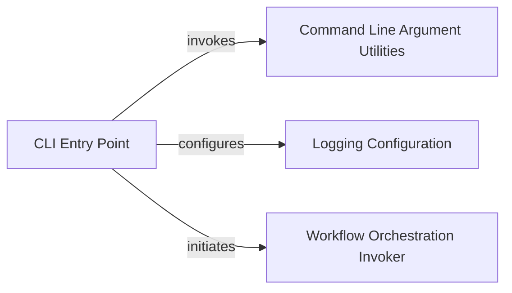

## Details

One paragraph explaining the functionality which is represented by this graph. What the main flow is and what is its purpose.

### CLI Entry Point

This is the primary executable script that users interact with. It serves as the application's main entry point, responsible for orchestrating the initial setup, parsing command-line arguments, configuring logging, and initiating the core application workflow. The `main` function, decorated with `@click.command`, handles the command-line interface, versioning, and option parsing. It then sets up logging and initiates the nonadditivity calculation.

**Related Classes/Methods**:

- <a href="https://github.com/Roche/NonadditivityAnalysis/blob/main/nonadditivity/cli.py#L15-L24" target="_blank" rel="noopener noreferrer">`nonadditivity.cli.main` (15:24)</a>

### Command Line Argument Utilities

This component centralizes the logic for defining, parsing, and validating command-line arguments. It provides reusable functions and data structures to ensure consistent argument handling across different CLI commands or options. The `add_entry_point_options` decorator is used to add common CLI options, and `InputOptions` encapsulates the parsed arguments.

**Related Classes/Methods**:

- <a href="https://github.com/Roche/NonadditivityAnalysis/blob/main/nonadditivity/utils/commandline.py#L1-L1" target="_blank" rel="noopener noreferrer">`nonadditivity.utils.commandline.add_entry_point_options` (1:1)</a>

- <a href="https://github.com/Roche/NonadditivityAnalysis/blob/main/nonadditivity/utils/commandline.py#L1-L1" target="_blank" rel="noopener noreferrer">`nonadditivity.utils.commandline.InputOptions` (1:1)</a>

### Logging Configuration

This component is responsible for setting up and configuring the application's logging system. It ensures that application events, errors, and debugging information are captured and managed effectively, providing crucial insights into the application's execution. The `setup_logging` function is called with the verbosity level and log file specified in the input options.

**Related Classes/Methods**:

- <a href="https://github.com/Roche/NonadditivityAnalysis/blob/main/nonadditivity/utils/log.py#L13-L46" target="_blank" rel="noopener noreferrer">`nonadditivity.utils.log.setup_logging` (13:46)</a>

### Workflow Orchestration Invoker

This component acts as the bridge between the CLI and the core nonadditivity calculation logic. It is responsible for receiving the parsed input options from the CLI and initiating the main data processing workflow. The `run_nonadd_calculation` function is invoked with the `InputOptions` object.

**Related Classes/Methods**:

- <a href="https://github.com/Roche/NonadditivityAnalysis/blob/main/nonadditivity/nonadditivity_workflow.py#L21-L97" target="_blank" rel="noopener noreferrer">`nonadditivity.nonadditivity_workflow.run_nonadd_calculation` (21:97)</a>

### [FAQ](https://github.com/CodeBoarding/GeneratedOnBoardings/tree/main?tab=readme-ov-file#faq)