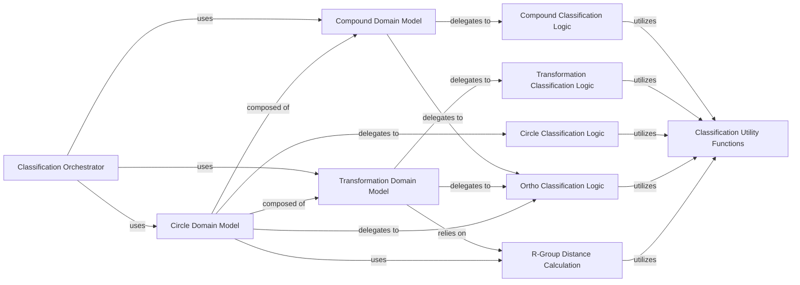

## Details

The `Classification & Domain Logic` subsystem is a core part of the `nonadditivity` project, responsible for defining and classifying chemical entities crucial to non-additivity analysis. Its structure reflects a clear separation of concerns, with dedicated modules for domain models and their associated classification logic. This structure ensures a clear flow of control and data, where the orchestrator initiates the process, domain models manage their data and delegate specific classification tasks, and dedicated logic modules perform the actual classification algorithms, leveraging shared utilities. This modularity enhances maintainability, testability, and extensibility, which are crucial for a scientific data processing application.

### Classification Orchestrator

This component acts as the primary entry point for initiating the classification process. It orchestrates the classification of `Compound`, `Transformation`, and `Circle` objects by invoking their respective classification methods and leveraging specialized classification logic modules. It serves as the application layer's interface to the core classification domain.

**Related Classes/Methods**:

- <a href="https://github.com/Roche/NonadditivityAnalysis/blob/main/nonadditivity/classification/classify.py#L1-L100" target="_blank" rel="noopener noreferrer">`nonadditivity.classification.classify` (1:100)</a>

### Compound Domain Model

Encapsulates the `Compound` entity, representing individual chemical compounds. It holds compound-specific data and provides methods for classifying compounds based on their structural and chemical properties. It delegates specific classification tasks to dedicated classification logic modules.

**Related Classes/Methods**:

- <a href="https://github.com/Roche/NonadditivityAnalysis/blob/main/nonadditivity/classification/classification_classes/compound.py#L1-L100" target="_blank" rel="noopener noreferrer">`nonadditivity.classification.classification_classes.compound` (1:100)</a>

### Transformation Domain Model

Defines the `Transformation` entity, representing a chemical transformation between two `Compound` objects. It encapsulates transformation-specific data, including constant and transforming parts of molecules, and provides methods for classifying transformations. It delegates specific classification tasks to dedicated classification logic modules and relies on R-group distance calculations.

**Related Classes/Methods**:

- <a href="https://github.com/Roche/NonadditivityAnalysis/blob/main/nonadditivity/classification/classification_classes/transfromation.py#L1-L100" target="_blank" rel="noopener noreferrer">`nonadditivity.classification.classification_classes.transfromation` (1:100)</a>

### Circle Domain Model

Represents a double-transformation cycle, often referred to as a "non-additivity circle." It encapsulates the `Compound` and `Transformation` objects that form the cycle and provides methods for classifying the circle's overall non-additivity behavior. It delegates specific classification tasks to dedicated classification logic modules.

**Related Classes/Methods**:

- <a href="https://github.com/Roche/NonadditivityAnalysis/blob/main/nonadditivity/classification/classification_classes/circle.py#L1-L100" target="_blank" rel="noopener noreferrer">`nonadditivity.classification.classification_classes.circle` (1:100)</a>

### Compound Classification Logic

Contains specialized functions and algorithms for classifying `Compound` objects based on various chemical and structural criteria. This module provides the detailed implementation for compound-specific classifications.

**Related Classes/Methods**:

- <a href="https://github.com/Roche/NonadditivityAnalysis/blob/main/nonadditivity/classification/compound_classification.py#L1-L100" target="_blank" rel="noopener noreferrer">`nonadditivity.classification.compound_classification` (1:100)</a>

### Transformation Classification Logic

Implements the algorithms and rules for classifying specific types of chemical transformations, such as changes in functional groups, heavy atom count, or other transformation-specific properties. These functions are invoked by the `Transformation` domain model.

**Related Classes/Methods**:

- <a href="https://github.com/Roche/NonadditivityAnalysis/blob/main/nonadditivity/classification/transformation_classification.py#L1-L100" target="_blank" rel="noopener noreferrer">`nonadditivity.classification.transformation_classification` (1:100)</a>

### Circle Classification Logic

Provides specialized functions for classifying `Circle` objects based on criteria relevant to double-transformation cycles, such as stereoinversion, tertiary amide formation, or differences in physicochemical properties across the cycle. These functions are invoked by the `Circle` domain model.

**Related Classes/Methods**:

- <a href="https://github.com/Roche/NonadditivityAnalysis/blob/main/nonadditivity/classification/circle_classification.py#L1-L100" target="_blank" rel="noopener noreferrer">`nonadditivity.classification.circle_classification` (1:100)</a>

### Ortho Classification Logic

Focuses on classifying chemical entities (compounds, transformations, and circles) based on whether chemical changes or structural features occur at *ortho* positions on a ring system. It includes functions for pattern matching and determining spatial relationships of substituents, crucial for specific SAR analysis.

**Related Classes/Methods**:

- <a href="https://github.com/Roche/NonadditivityAnalysis/blob/main/nonadditivity/classification/ortho_classification.py#L1-L100" target="_blank" rel="noopener noreferrer">`nonadditivity.classification.ortho_classification` (1:100)</a>

### R-Group Distance Calculation

A utility module providing functions for calculating distances and identifying R-groups (substituents) within molecules and transformations. This is a foundational utility for understanding the structural context of chemical changes and is leveraged by domain models and classification logic.

**Related Classes/Methods**:

- <a href="https://github.com/Roche/NonadditivityAnalysis/blob/main/nonadditivity/classification/rgroup_distance.py#L1-L100" target="_blank" rel="noopener noreferrer">`nonadditivity.classification.rgroup_distance` (1:100)</a>

### Classification Utility Functions

A collection of general-purpose helper functions specifically used across various classification modules. These include common operations like checking for uniqueness, handling lists, or other small, reusable pieces of logic that support the classification algorithms.

**Related Classes/Methods**:

- <a href="https://github.com/Roche/NonadditivityAnalysis/blob/main/nonadditivity/classification/utils.py#L1-L100" target="_blank" rel="noopener noreferrer">`nonadditivity.classification.utils` (1:100)</a>

### [FAQ](https://github.com/CodeBoarding/GeneratedOnBoardings/tree/main?tab=readme-ov-file#faq)