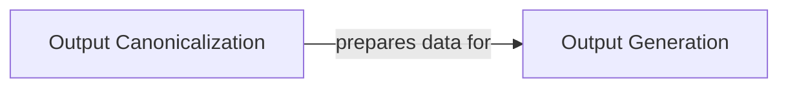

## Details

The `Output Management` subsystem is crucial for the `NonadditivityAnalysis` project, handling the final stages of data processing by ensuring all analysis results are consistently formatted and written to various output files. This component adheres to the project's architectural bias for modularity and a clear separation of concerns, acting as the bridge between the core nonadditivity logic and the persistent storage of results.

### Output Canonicalization

This component is responsible for standardizing and preparing the calculated nonadditivity data into a canonical and consistent format. It ensures data integrity and uniformity across various output files by performing necessary transformations, formatting, and potentially final calculations before the data is written. It acts as a crucial intermediary between the core analysis logic and the final output generation. Specifically, it handles the canonicalization of transformations to avoid redundant or reversed entries, ensuring that each unique transformation is represented consistently. It also recalculates nonadditivity values based on the canonical order and manages the inclusion of various circle properties.

**Related Classes/Methods**:

- <a href="https://github.com/Roche/NonadditivityAnalysis/blob/main/nonadditivity/workflow/canonicalize_output.py#L1-L1" target="_blank" rel="noopener noreferrer">`nonadditivity.workflow.canonicalize_output` (1:1)</a>

- <a href="https://github.com/Roche/NonadditivityAnalysis/blob/main/nonadditivity/workflow/nonadditivity_core.py#L294-L310" target="_blank" rel="noopener noreferrer">`nonadditivity.workflow.nonadditivity_core:_create_circle_ids` (294:310)</a>

- <a href="https://github.com/Roche/NonadditivityAnalysis/blob/main/nonadditivity/utils/math.py#L236-L253" target="_blank" rel="noopener noreferrer">`nonadditivity.utils.math:_calculate_nonadditivity` (236:253)</a>

### Output Generation

This component handles the actual writing of all final processed data and analysis results to various output files (e.g., per-compound files, canonical nonadditivity analysis files) and potentially standard deviation reports to the command line. It takes the canonicalized data and persists it in the specified formats. It also includes functionality for transforming per-compound dataframes for output, handling censored values, and writing SMILES ID files for external tools like MMPDB.

**Related Classes/Methods**:

- <a href="https://github.com/Roche/NonadditivityAnalysis/blob/main/nonadditivity/workflow/output.py#L1-L1" target="_blank" rel="noopener noreferrer">`nonadditivity.workflow.output` (1:1)</a>

- <a href="https://github.com/Roche/NonadditivityAnalysis/blob/main/nonadditivity/workflow/canonicalize_output.py#L1-L1" target="_blank" rel="noopener noreferrer">`nonadditivity.workflow.canonicalize_output:canonicalize_na_dataframe` (1:1)</a>

- <a href="https://github.com/Roche/NonadditivityAnalysis/blob/main/nonadditivity/utils/math.py#L26-L50" target="_blank" rel="noopener noreferrer">`nonadditivity.utils.math:mad_std` (26:50)</a>

- <a href="https://github.com/Roche/NonadditivityAnalysis/blob/main/nonadditivity/utils/math.py#L53-L96" target="_blank" rel="noopener noreferrer">`nonadditivity.utils.math:sn_medmed_std` (53:96)</a>

- <a href="https://github.com/Roche/NonadditivityAnalysis/blob/main/nonadditivity/utils/log.py#L49-L56" target="_blank" rel="noopener noreferrer">`nonadditivity.utils.log:get_logger` (49:56)</a>

### [FAQ](https://github.com/CodeBoarding/GeneratedOnBoardings/tree/main?tab=readme-ov-file#faq)