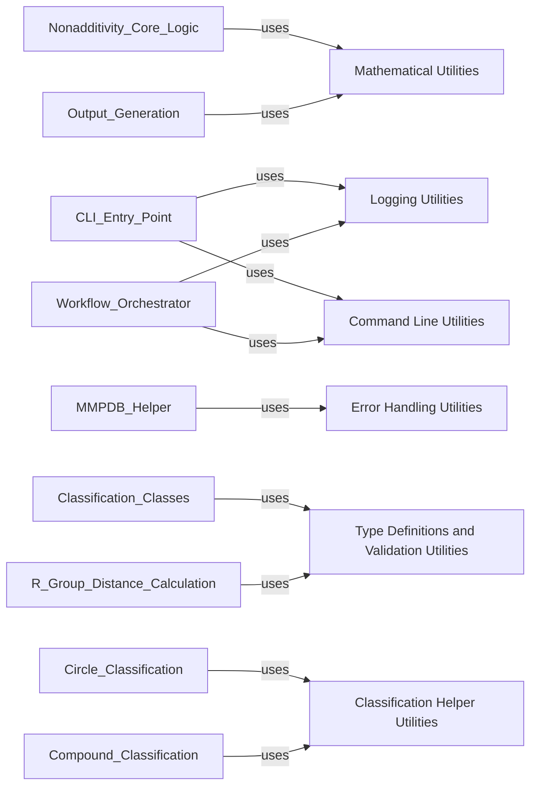

## Details

The Shared Utilities component serves as a foundational layer within the nonadditivity project, providing a centralized collection of reusable helper functions and common functionalities. It encapsulates various cross-cutting concerns, including mathematical operations, logging, error handling, type definitions, command-line interface helpers, and specific utilities for the classification workflow. This modular design promotes code reusability, maintainability, and a clear separation of concerns, aligning with the project's emphasis on a highly modular and cohesive architecture. By abstracting these common functionalities, the core business logic remains cleaner and more focused.

### Mathematical Utilities

Provides a collection of common mathematical functions and statistical operations. These are fundamental for numerical computations across various parts of the application, especially for calculating non-additivity metrics and statistical properties in the core logic and output generation.

**Related Classes/Methods**:

- <a href="https://github.com/Roche/NonadditivityAnalysis/blob/main/nonadditivity/utils/math.py#L1-L1" target="_blank" rel="noopener noreferrer">`nonadditivity.utils.math` (1:1)</a>

### Logging Utilities

Handles all logging functionalities within the application, providing a centralized and consistent way to record events, debug information, warnings, and errors. This is crucial for monitoring application execution and troubleshooting.

**Related Classes/Methods**:

- <a href="https://github.com/Roche/NonadditivityAnalysis/blob/main/nonadditivity/utils/log.py#L1-L1" target="_blank" rel="noopener noreferrer">`nonadditivity.utils.log` (1:1)</a>

### Error Handling Utilities

Defines custom exception types and provides helper functions for robust error management. This ensures that specific errors can be caught and handled gracefully, improving the application's resilience and user feedback.

**Related Classes/Methods**:

- <a href="https://github.com/Roche/NonadditivityAnalysis/blob/main/nonadditivity/utils/errors.py#L1-L1" target="_blank" rel="noopener noreferrer">`nonadditivity.utils.errors` (1:1)</a>

### Type Definitions and Validation Utilities

Contains custom data types, enums, and validation functions used throughout the application to ensure data consistency and integrity. This promotes type safety and helps prevent common data-related bugs.

**Related Classes/Methods**:

- <a href="https://github.com/Roche/NonadditivityAnalysis/blob/main/nonadditivity/utils/types.py#L1-L1" target="_blank" rel="noopener noreferrer">`nonadditivity.utils.types` (1:1)</a>

### Command Line Utilities

Provides helper functions specifically designed to assist with command-line interface operations, such as argument parsing, progress bar management, or other CLI-specific interactions.

**Related Classes/Methods**:

- <a href="https://github.com/Roche/NonadditivityAnalysis/blob/main/nonadditivity/utils/commandline.py#L1-L1" target="_blank" rel="noopener noreferrer">`nonadditivity.utils.commandline` (1:1)</a>

### Classification Helper Utilities

Offers utility functions specifically tailored for the classification workflow, including general data manipulation, validation checks for atom indices and matches, and cheminformatics-specific conversions like SMARTS to SMILES. These functions support the various classification modules by providing common, reusable logic.

**Related Classes/Methods**:

- <a href="https://github.com/Roche/NonadditivityAnalysis/blob/main/nonadditivity/classification/utils.py#L1-L1" target="_blank" rel="noopener noreferrer">`nonadditivity.classification.utils` (1:1)</a>

### [FAQ](https://github.com/CodeBoarding/GeneratedOnBoardings/tree/main?tab=readme-ov-file#faq)