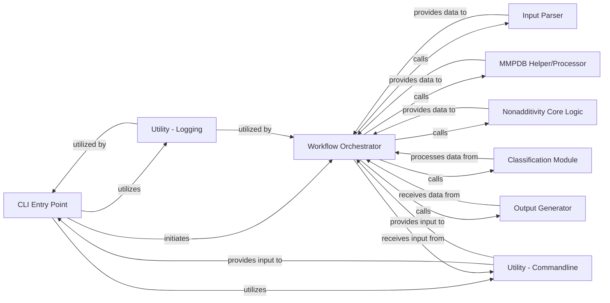

## Details

The `Workflow Orchestrator` is the central coordinating component of the nonadditivity analysis application. It embodies the pipeline/workflow architectural pattern, ensuring the sequential and correct execution of various sub-processes from data ingestion to final output. Its fundamental role is to manage the data flow and delegate specific tasks to specialized modules, acting as the backbone of the application's analytical process.

### CLI Entry Point

The primary interface for users to interact with the nonadditivity analysis tool. It parses command-line arguments and initiates the main workflow.

**Related Classes/Methods**:

- <a href="https://github.com/Roche/NonadditivityAnalysis/blob/main/nonadditivity/cli.py#L1-L1000" target="_blank" rel="noopener noreferrer">`nonadditivity.cli` (1:1000)</a>

### Workflow Orchestrator [[Expand]](./Workflow_Orchestrator.md)

Manages the overall execution flow of the nonadditivity analysis, coordinating the sequence of operations from input processing through core logic to final output generation. It acts as the central coordinator, delegating tasks to specialized modules.

**Related Classes/Methods**:

- <a href="https://github.com/Roche/NonadditivityAnalysis/blob/main/nonadditivity/nonadditivity_workflow.py#L21-L97" target="_blank" rel="noopener noreferrer">`nonadditivity.nonadditivity_workflow:run_nonadd_calculation` (21:97)</a>

### Input Parser

Responsible for reading, validating, and pre-processing the raw input data (e.g., SMILES, properties) required for the nonadditivity analysis.

**Related Classes/Methods**:

- <a href="https://github.com/Roche/NonadditivityAnalysis/blob/main/nonadditivity/workflow/input_parsing.py#L1-L1000" target="_blank" rel="noopener noreferrer">`nonadditivity.workflow.input_parsing` (1:1000)</a>

### MMPDB Helper/Processor

Handles the generation and processing of Matched Molecular Pairs (MMPs) using the mmpdb library, which are crucial for the nonadditivity analysis.

**Related Classes/Methods**:

- <a href="https://github.com/Roche/NonadditivityAnalysis/blob/main/nonadditivity/workflow/mmpdb_helper.py#L1-L1000" target="_blank" rel="noopener noreferrer">`nonadditivity.workflow.mmpdb_helper` (1:1000)</a>

### Nonadditivity Core Logic

Encapsulates the primary algorithms for calculating nonadditivity and identifying double-transformation cycles based on the processed MMPs.

**Related Classes/Methods**:

- <a href="https://github.com/Roche/NonadditivityAnalysis/blob/main/nonadditivity/workflow/nonadditivity_core.py#L1-L1000" target="_blank" rel="noopener noreferrer">`nonadditivity.workflow.nonadditivity_core` (1:1000)</a>

### Classification Module

Applies classification rules or models to categorize the nonadditivity analysis results, providing insights into the nature of the observed nonadditivity.

**Related Classes/Methods**:

- <a href="https://github.com/Roche/NonadditivityAnalysis/blob/main/nonadditivity/classification/classify.py#L1-L1000" target="_blank" rel="noopener noreferrer">`nonadditivity.classification.classify` (1:1000)</a>

### Output Generator

Formats and writes the final results of the nonadditivity analysis, including raw data, processed MMPs, and nonadditivity scores, to specified output files.

**Related Classes/Methods**:

- <a href="https://github.com/Roche/NonadditivityAnalysis/blob/main/nonadditivity/workflow/output.py#L1-L1000" target="_blank" rel="noopener noreferrer">`nonadditivity.workflow.output` (1:1000)</a>

### Utility - Logging

Provides a centralized logging mechanism for the application, enabling tracking of execution progress, debugging, and error reporting.

**Related Classes/Methods**:

- <a href="https://github.com/Roche/NonadditivityAnalysis/blob/main/nonadditivity/utils/log.py#L1-L1000" target="_blank" rel="noopener noreferrer">`nonadditivity.utils.log` (1:1000)</a>

### Utility - Commandline

Contains helper functions and data structures for parsing and managing command-line arguments and options, ensuring consistent input handling across the application.

**Related Classes/Methods**:

- <a href="https://github.com/Roche/NonadditivityAnalysis/blob/main/nonadditivity/utils/commandline.py#L1-L1000" target="_blank" rel="noopener noreferrer">`nonadditivity.utils.commandline` (1:1000)</a>

### [FAQ](https://github.com/CodeBoarding/GeneratedOnBoardings/tree/main?tab=readme-ov-file#faq)