```mermaid

graph LR

    CLI_Interface["CLI Interface"]

    Workflow_Orchestrator["Workflow Orchestrator"]

    Core_Data_Processing["Core Data Processing"]

    Classification_Domain_Logic["Classification & Domain Logic"]

    Output_Management["Output Management"]

    Shared_Utilities["Shared Utilities"]

    CLI_Interface -- "initiates" --> Workflow_Orchestrator

    Workflow_Orchestrator -- "calls" --> Core_Data_Processing

    Workflow_Orchestrator -- "calls" --> Classification_Domain_Logic

    Workflow_Orchestrator -- "calls" --> Output_Management

    Core_Data_Processing -- "provides data to" --> Classification_Domain_Logic

    Core_Data_Processing -- "provides data to" --> Output_Management

    Core_Data_Processing -- "utilizes" --> Shared_Utilities

    Classification_Domain_Logic -- "provides classified data to" --> Output_Management

    Classification_Domain_Logic -- "utilizes" --> Shared_Utilities

    Output_Management -- "utilizes" --> Shared_Utilities

    click CLI_Interface href "https://github.com/Roche/NonadditivityAnalysis/blob/main/.codeboarding//CLI_Interface.md" "Details"

    click Workflow_Orchestrator href "https://github.com/Roche/NonadditivityAnalysis/blob/main/.codeboarding//Workflow_Orchestrator.md" "Details"

    click Classification_Domain_Logic href "https://github.com/Roche/NonadditivityAnalysis/blob/main/.codeboarding//Classification_Domain_Logic.md" "Details"

    click Output_Management href "https://github.com/Roche/NonadditivityAnalysis/blob/main/.codeboarding//Output_Management.md" "Details"

    click Shared_Utilities href "https://github.com/Roche/NonadditivityAnalysis/blob/main/.codeboarding//Shared_Utilities.md" "Details"

```

## Details

Abstract Components Overview of the nonadditivity analysis project.

### CLI Interface [[Expand]](./CLI_Interface.md)

Serves as the primary user interface, responsible for parsing command-line arguments and initiating the main application workflow.

**Related Classes/Methods**:

- <a href="https://github.com/Roche/NonadditivityAnalysis/blob/main/nonadditivity/cli.py#L1-L1" target="_blank" rel="noopener noreferrer">`nonadditivity.cli` (1:1)</a>

- <a href="https://github.com/Roche/NonadditivityAnalysis/blob/main/nonadditivity/utils/commandline.py#L1-L1" target="_blank" rel="noopener noreferrer">`nonadditivity.utils.commandline` (1:1)</a>

### Workflow Orchestrator [[Expand]](./Workflow_Orchestrator.md)

Manages the overall execution flow of the nonadditivity analysis, coordinating the sequence of operations from input processing through core logic to final output generation.

**Related Classes/Methods**:

- <a href="https://github.com/Roche/NonadditivityAnalysis/blob/main/nonadditivity/nonadditivity_workflow.py#L1-L1" target="_blank" rel="noopener noreferrer">`nonadditivity.nonadditivity_workflow` (1:1)</a>

### Core Data Processing

Handles the core scientific data manipulation, including reading and validating input, generating matched molecular pairs (MMPs), and implementing the central algorithms for identifying double-transformation cycles and calculating nonadditivity values.

**Related Classes/Methods**:

- <a href="https://github.com/Roche/NonadditivityAnalysis/blob/main/nonadditivity/workflow/input_parsing.py#L1-L1" target="_blank" rel="noopener noreferrer">`nonadditivity.workflow.input_parsing` (1:1)</a>

- <a href="https://github.com/Roche/NonadditivityAnalysis/blob/main/nonadditivity/workflow/mmpdb_helper.py#L1-L1" target="_blank" rel="noopener noreferrer">`nonadditivity.workflow.mmpdb_helper` (1:1)</a>

- <a href="https://github.com/Roche/NonadditivityAnalysis/blob/main/nonadditivity/workflow/nonadditivity_core.py#L1-L1" target="_blank" rel="noopener noreferrer">`nonadditivity.workflow.nonadditivity_core` (1:1)</a>

### Classification & Domain Logic [[Expand]](./Classification_Domain_Logic.md)

Encapsulates the domain models for chemical entities (Compound, Transformation, Circle) and implements the algorithms for classifying these entities based on various chemical and structural criteria.

**Related Classes/Methods**:

- <a href="https://github.com/Roche/NonadditivityAnalysis/blob/main/nonadditivity/classification/classify.py#L1-L1" target="_blank" rel="noopener noreferrer">`nonadditivity.classification.classify` (1:1)</a>

- <a href="https://github.com/Roche/NonadditivityAnalysis/blob/main/nonadditivity/classification/classification_classes/compound.py#L1-L1" target="_blank" rel="noopener noreferrer">`nonadditivity.classification.classification_classes.compound` (1:1)</a>

- <a href="https://github.com/Roche/NonadditivityAnalysis/blob/main/nonadditivity/classification/classification_classes/transfromation.py#L1-L1" target="_blank" rel="noopener noreferrer">`nonadditivity.classification.classification_classes.transfromation` (1:1)</a>

- <a href="https://github.com/Roche/NonadditivityAnalysis/blob/main/nonadditivity/classification/classification_classes/circle.py#L1-L1" target="_blank" rel="noopener noreferrer">`nonadditivity.classification.classification_classes.circle` (1:1)</a>

- <a href="https://github.com/Roche/NonadditivityAnalysis/blob/main/nonadditivity/classification/circle_classification.py#L1-L1" target="_blank" rel="noopener noreferrer">`nonadditivity.classification.circle_classification` (1:1)</a>

- <a href="https://github.com/Roche/NonadditivityAnalysis/blob/main/nonadditivity/classification/ortho_classification.py#L1-L1" target="_blank" rel="noopener noreferrer">`nonadditivity.classification.ortho_classification` (1:1)</a>

- <a href="https://github.com/Roche/NonadditivityAnalysis/blob/main/nonadditivity/classification/rgroup_distance.py#L1-L1" target="_blank" rel="noopener noreferrer">`nonadditivity.classification.rgroup_distance` (1:1)</a>

- <a href="https://github.com/Roche/NonadditivityAnalysis/blob/main/nonadditivity/classification/transformation_classification.py#L1-L1" target="_blank" rel="noopener noreferrer">`nonadditivity.classification.transformation_classification` (1:1)</a>

- <a href="https://github.com/Roche/NonadditivityAnalysis/blob/main/nonadditivity/classification/compound_classification.py#L1-L1" target="_blank" rel="noopener noreferrer">`nonadditivity.classification.compound_classification` (1:1)</a>

### Output Management [[Expand]](./Output_Management.md)

Manages the writing of all processed data and analysis results to various output files, including canonicalizing and formatting dataframes for consistent output.

**Related Classes/Methods**:

- <a href="https://github.com/Roche/NonadditivityAnalysis/blob/main/nonadditivity/workflow/output.py#L1-L1" target="_blank" rel="noopener noreferrer">`nonadditivity.workflow.output` (1:1)</a>

- <a href="https://github.com/Roche/NonadditivityAnalysis/blob/main/nonadditivity/workflow/canonicalize_output.py#L1-L1" target="_blank" rel="noopener noreferrer">`nonadditivity.workflow.canonicalize_output` (1:1)</a>

### Shared Utilities [[Expand]](./Shared_Utilities.md)

Provides a collection of common helper functions for mathematical operations, general data manipulation, and validation, used across various components of the application.

**Related Classes/Methods**:

- <a href="https://github.com/Roche/NonadditivityAnalysis/blob/main/nonadditivity/utils/math.py#L1-L1" target="_blank" rel="noopener noreferrer">`nonadditivity.utils.math` (1:1)</a>

- <a href="https://github.com/Roche/NonadditivityAnalysis/blob/main/nonadditivity/classification/utils.py#L1-L1" target="_blank" rel="noopener noreferrer">`nonadditivity.classification.utils` (1:1)</a>

- <a href="https://github.com/Roche/NonadditivityAnalysis/blob/main/nonadditivity/utils/errors.py#L1-L1" target="_blank" rel="noopener noreferrer">`nonadditivity.utils.errors` (1:1)</a>

- <a href="https://github.com/Roche/NonadditivityAnalysis/blob/main/nonadditivity/utils/log.py#L1-L1" target="_blank" rel="noopener noreferrer">`nonadditivity.utils.log` (1:1)</a>

- <a href="https://github.com/Roche/NonadditivityAnalysis/blob/main/nonadditivity/utils/types.py#L1-L1" target="_blank" rel="noopener noreferrer">`nonadditivity.utils.types` (1:1)</a>

### [FAQ](https://github.com/CodeBoarding/GeneratedOnBoardings/tree/main?tab=readme-ov-file#faq)